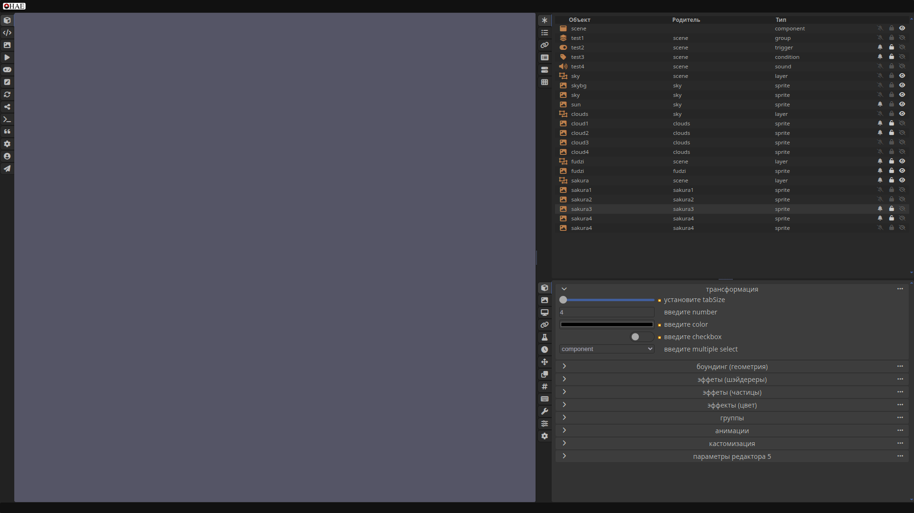
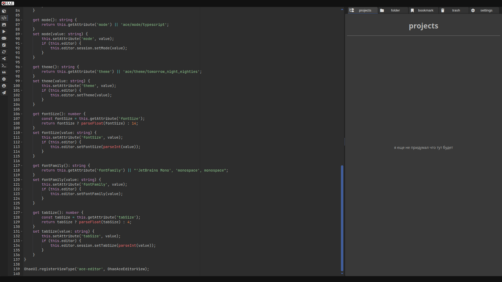

# ohae-ui-webcomponents
UI for game editors on PC

#### about

A UI component library for building game graphic editors, mimicking the look and feel of Blender's interface. It includes:

- A set of UI components:
    - **Layout** component – a container for arranging the workspace layout
    - **Resizer** component – a resizer that adjusts the sizes of sibling Layout components
    - **Separator** component – a visible divider between Layouts or other blocks
    - **Accordion** component – a standard accordion that allows nested items to expand/collapse and be reordered within the accordion container
    - **Icon** component – used for controlling the display of FontAwesome icons
    - **Tabs** component – unconventional tabs that support positioning tab buttons on any side (top, bottom, right, left) and optionally showing or hiding tab labels
    - **DataTable** component – for displaying tabular data
    - **AceEditor** component – a wrapper for embedding the Ace code editor
    - **Button** component – a styled button
    - **IconCheckbox** component – a FontAwesome icon that toggles between on/off states when clicked
    - **Select** component – a customized and styled select input
    - **Textarea** component – a customized and styled textarea
    - **Input** component – a customized and styled input
    - **Toggle** component – a styled toggle (essentially a nicer checkbox)
    - And several other components. All input components include labels and `required` fields. All components are reactive.

- A state manager (implemented but not fully integrated into the UI components yet)
- Various utilities for transformation and modification of:
    - colors
    - size units
    - etc.
- a general interface initialization module based on JSON layout data  
- interface layout definition for the editor

#### online demo

[https://game.ragame.ru/ohae-ui/](https://game.ragame.ru/ohae-ui/)

#### screenshots

